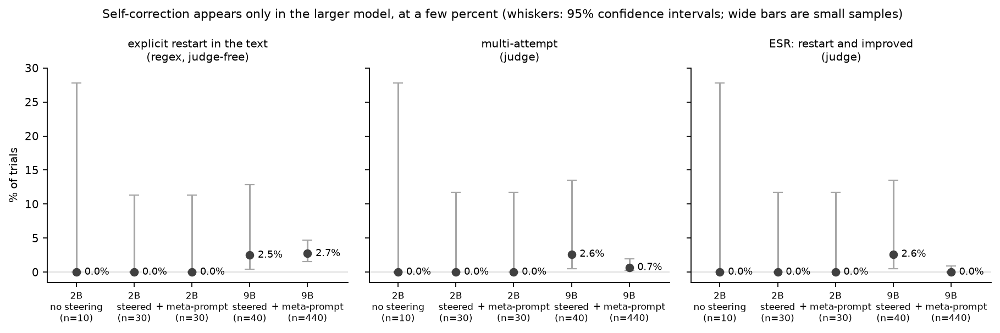
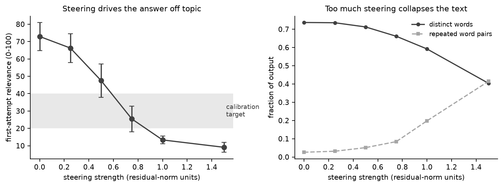
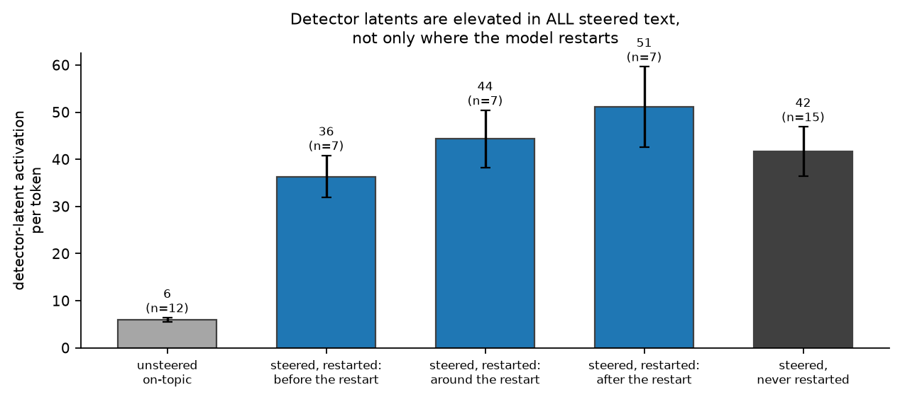
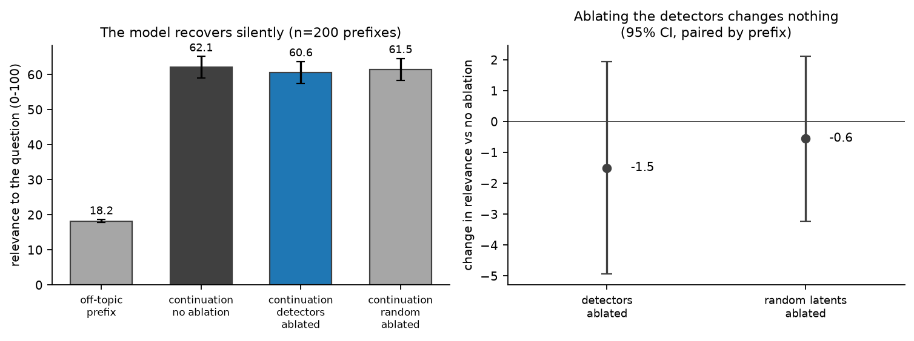

# Endogenous steering resistance on a single GPU

A re-implementation of

> McKenzie et al., *Endogenous Resistance to Activation Steering in Language Models*, ICML 2026
> ([arXiv:2602.06941](https://arxiv.org/abs/2602.06941))

written for learning and experimenting. It is not the authors' code and is not affiliated with
them; see the paper for the original work. Judge prompts and the threshold-finding routine are
adapted from the authors' repository (Apache-2.0).

## Overview

Activation steering adds a fixed direction to a model's residual stream, pushing it toward an
unrelated concept while it answers a question. The paper reports that models sometimes notice
this mid-answer, say so, and return to the question while the push is still on: *endogenous
steering resistance* (ESR). It also reports that ablating a set of "off-topic detector" SAE latents
reduces the effect. This repository

1. steers Gemma-2-2B-IT and Gemma-2-9B-IT with Gemma Scope SAE decoder directions at every token
   of the answer,
2. calibrates each latent's steering strength by probabilistic bisection to a target first-attempt
   relevance score,
3. has a judge split each answer into attempts and score them, and computes multi-attempt,
   improvement and ESR rates with Wilson intervals,
4. finds candidate detector latents by contrastive search, and tests them by ablation against a
   random-latent control.



## Differences from the paper

- The default judge is an open model (Qwen2.5-7B-Instruct) on the same GPU rather than Claude.
  Attempt boundaries are accepted only where a restart phrase occurs in the model's text, since
  small judges otherwise split on headings. The paper's judge is available with `--judge anthropic`.
- A boost sweep records how relevance and coherence degrade with steering strength.
- Detector-latent activity is also measured in steered text where the model never restarts, as a
  control for the correlational claim.
- A prefill test with paired ablation: an unsteered model continues its own off-topic text, with
  and without the detector latents ablated and with random latents ablated. Restarts are rare
  under steering, so this is where the ablation test has power.



## Results

| | Gemma-2-2B | Gemma-2-9B |
|---|---|---|
| Unsteered: explicit restarts | 0 of 10 | not run |
| Steered: explicit restarts | 0 of 30 | 2.5% (n = 40) |
| Steered + meta-prompt: explicit restarts | 0 of 30 | 2.7% (n = 440) |

- Self-correction appears only in the larger model, at a few percent, within the range the paper
  reports for models of this size.
- The candidate detector latents are about six times more active in steered than in unsteered
  text, but equally active in steered text where the model never restarts: they track off-topic
  content rather than the decision to correct.
- Continuing its own off-topic text, the unsteered 9B model recovers relevance from 18 to 62
  (0-100), almost always without a restart phrase. Ablating the 26 detector latents changes
  recovery by -1.5 points (95% CI -5.0 to +2.0), no different from ablating random latents.




## Setup

```bash
git clone https://github.com/shouvik-majumder/steering-resistance.git
cd steering-resistance
conda create -n esr python=3.12 -y
conda activate esr
pip install torch --index-url https://download.pytorch.org/whl/cu128   # or the build for your system
pip install -r requirements.txt
cp .env.example .env    # then add a Hugging Face token (HF_TOKEN)
```

Gemma is gated: accept its licence on Hugging Face with the account that owns `HF_TOKEN`.
Gemma-2-2B and the local judge fit together on a 24 GB GPU. For Gemma-2-9B, generate first with
`--judge none` and judge afterwards with `05_judge_results.py`.

## Usage

| Step | Command |
|---|---|
| Smoke test (SAE, hook, generation) | `python scripts/00_smoke_test.py` |
| Qualitative steering demo | `python scripts/01_steer_demo.py --search "body"` |
| Calibrate steering strength | `python scripts/02_calibrate.py --latents <ids>` |
| Run the protocol | `python scripts/03_run_esr.py --n-latents 20 --trials-per-latent 10 [--meta-prompt]` |
| Find detector latents | `python scripts/04_find_detectors.py` |
| Judge saved results | `python scripts/05_judge_results.py --results "data/results/*.jsonl"` |
| Metrics and plots | `python scripts/06_analyze.py --plots` |
| Replay high-rate configurations with ablation | `python scripts/07_hotspot_replay.py --model gemma-9b --judge self` |
| Detector traces through episodes | `python scripts/08_episode_traces.py --model gemma-9b --detectors <file>` |
| Prefill test with paired ablation | `python scripts/09_prefill_detection.py --model gemma-9b --judge self` |
| Boost sweep | `python scripts/11_boost_sweep.py --model gemma-2b --latents <ids>` |

Runs append one JSON line per trial to `data/results/` and resume when re-run.
`scripts/judge_check.py` checks a judge on canned responses.

## Layout

```
esr/config.py      model/SAE registry, experiment settings, paths
esr/model.py       SteeringEngine: model + SAE, steering/ablation hook, generation
esr/judge.py       local, Anthropic and regex judges; restart-phrase gating
esr/threshold.py   probabilistic bisection
esr/calibrate.py   per-latent steering calibration
esr/features.py    latent labels, relevance filter, latent sampling
esr/detectors.py   contrastive detector search
esr/metrics.py     multi-attempt, improvement and ESR rates, Wilson intervals
data/labels/       Neuronpedia labels for the Gemma Scope SAEs used
prompts.txt        the question set
```

## License

MIT; see [LICENSE](LICENSE).
